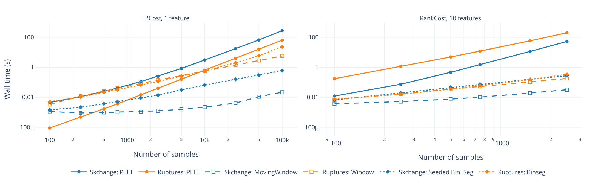
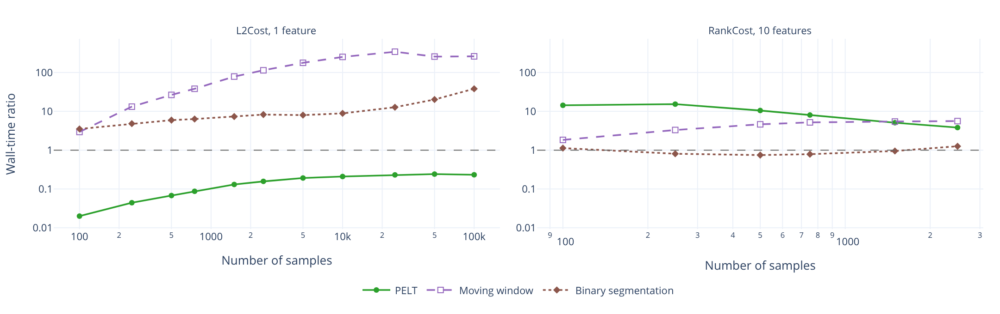
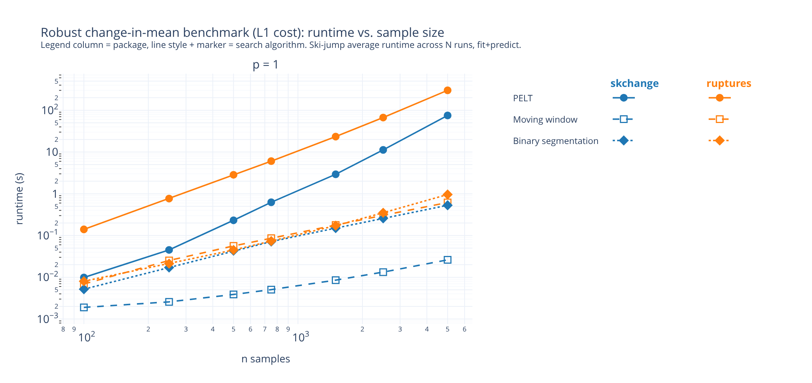
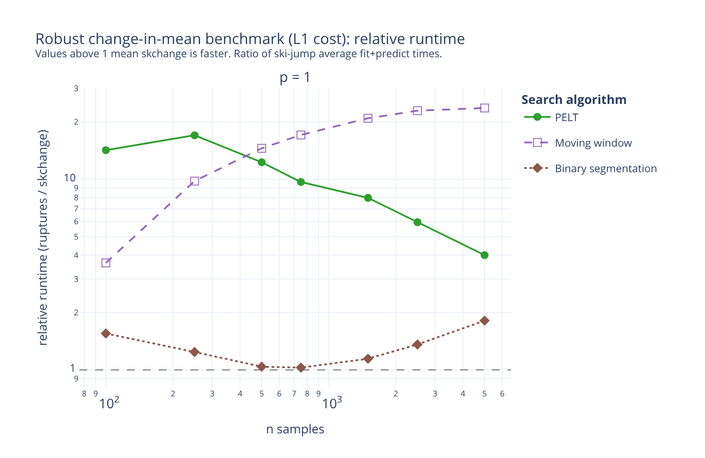
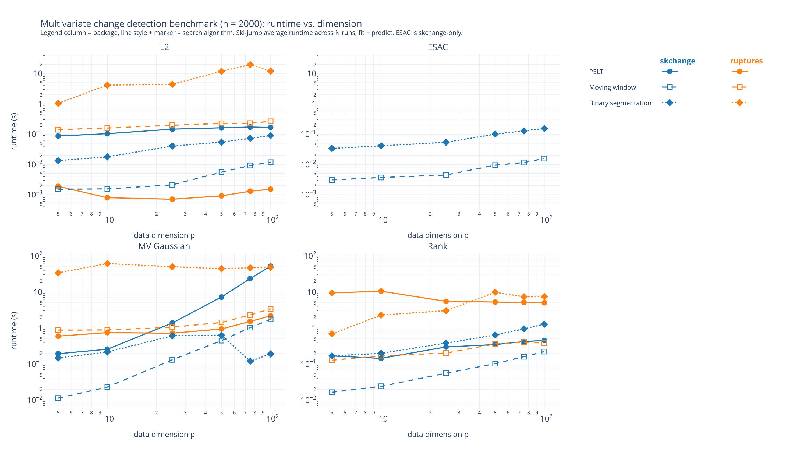
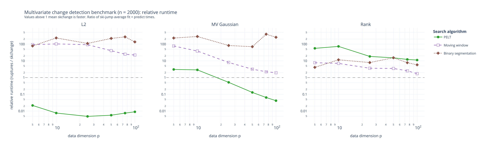

# change-point-benchmark

Benchmarks comparing the runtime performance of change-point detection packages,
primarily [skchange](https://github.com/NorskRegnesentral/skchange) vs.
[ruptures](https://github.com/deepcharles/ruptures).

> **Looking for the results?** All benchmark result files (Parquet) are in
> [results/paper/](results/paper/), with the curated results behind the figures
> below in [results/paper/visualized_results/](results/paper/visualized_results/).
> All generated figures (HTML, PDF, PNG) are in [figures/paper/](figures/paper/).

## Headline results

Wall time of full change-point detection (fit + predict) on null data, for a
univariate change-in-mean setup (`L2Cost`, 1 feature) and a multivariate
rank-based setup (`RankCost`, 10 features):



The same comparison as relative speedup (ruptures runtime divided by skchange
runtime; values above 1 mean skchange is faster):



Benchmarks were run on an Intel 10 Core Xeon Silver 4110 @ 2.10 GHz with 49 GiB RAM,
Ubuntu 22.04.5 LTS.

## Getting started

Requires Python 3.12+ and the [uv](https://docs.astral.sh/uv/) package manager.

```bash
uv sync --dev              # install all dependencies
uv run pytest tests/       # run the unit tests
uv run bench --list        # list all available comparison pairs
```

Ad-hoc benchmark runs use the `bench` CLI:

```bash
uv run bench --pairs pelt_l2 --n-samples 1000 5000 --runs 5 -o results/pelt_l2.parquet
```

## Reproducing the figures

Each figure is produced by a benchmark script (writes Parquet to
`results/paper/`) followed by a plotting script (writes HTML/PDF/PNG to
`figures/paper/`), all run via `uv run python <script>`. The compact score
figure reads its results from `results/paper/visualized_results/`, so move
fresh result files there before re-plotting it:

| Figure | Benchmark script(s) | Plotting script |
|--------|---------------------|-----------------|
| Compact score comparison (above) | `scripts/paper_benchmarks/run_change_in_mean_benchmark.py`, `scripts/paper_benchmarks/run_rank_score_benchmark.py` | `scripts/paper_plotting/plot_compact_score_benchmarks.py` |
| Change-in-mean (L2) | `scripts/paper_benchmarks/run_change_in_mean_benchmark.py` | `scripts/paper_plotting/plot_change_in_mean_benchmark.py` |
| Robust change-in-mean (L1) | `scripts/paper_benchmarks/run_change_in_mean_l1_benchmark.py` | `scripts/paper_plotting/plot_l1_change_in_mean_benchmark.py` |
| Multivariate dimension sweep | `scripts/paper_benchmarks/run_multivariate_dimension_benchmark.py` | `scripts/paper_plotting/plot_mv_dimension_benchmark.py` |

The benchmark scripts are resumable: completed cases found in the output
Parquet file are skipped, so an interrupted run can simply be restarted.

## Methodology

Benchmarks are organised as **comparison pairs**: a skchange detector and its
closest ruptures equivalent, configured to be as comparable as possible (same
penalty, minimum segment length, window width, etc.). One-sided pairs are used
where no counterpart exists (e.g. ESAC).

The timed operations are:

- skchange: `detector.fit(X).predict_changepoints(X)`
- ruptures: `detector.fit_predict(X, pen=penalty)`

Each case is timed over several repetitions with garbage collection disabled,
and summary statistics (mean, std, median, min, and trimmed variants) are
stored per case.

### Penalties and spurious detections

All benchmarks run on null data (no true change points) with a penalty set
high enough that no spurious change points are detected. The configured
`penalty` and the observed `n_detected_changepoints` are stored in every
result file and printed as a summary table at the end of each benchmark run,
so users can confirm that all timings correspond to zero detections.

### Comparison pairs

| Pair name | ruptures | skchange |
|-----------|----------|----------|
| `pelt_l2` | `KernelCPD("linear")` | `PELT(L2Cost())` |
| `pelt_l1` | `Pelt("l1")` | `PELT(L1Cost())` |
| `pelt_1d_gaussian` | `Pelt("normal")` | `PELT(GaussianCost())` |
| `pelt_mv_gaussian` | `Pelt("normal")` | `PELT(MultivariateGaussianCost())` |
| `pelt_poisson` | custom `BaseCost` | `PELT(PoissonCost())` |
| `pelt_rank` | `Pelt("rank")` | `PELT(RankCost())` |
| `moving_window_l2` | `Window("l2")` | `MovingWindow(CUSUM())` |
| `moving_window_l1` | `Window("l1")` | `MovingWindow(CostChangeScore(L1Cost()))` |
| `moving_window_mv_gaussian` | `Window("normal")` | `MovingWindow(MultivariateGaussianScore())` |
| `moving_window_rank` | `Window("rank")` | `MovingWindow(CostChangeScore(RankCost()))` |
| `binseg_l2_cusum` | `Binseg("l2")` | `SeededBinarySegmentation(CUSUM())` |
| `binseg_l1` | `Binseg("l1")` | `SeededBinarySegmentation(CostChangeScore(L1Cost()))` |
| `binseg_mv_gaussian` | `Binseg("normal")` | `SeededBinarySegmentation(MultivariateGaussianScore())` |
| `binseg_rank` | `Binseg("rank")` | `SeededBinarySegmentation(CostChangeScore(RankCost()))` |

Run `uv run bench --list` for the full, up-to-date list (including linear
regression, linear trend, and ESAC pairs).

## Supplementary benchmarks

### Robust change-in-mean (L1 cost)

Runtime for the L1 (robust) change-in-mean pairs across sample sizes:





Reproduce with `scripts/paper_benchmarks/run_change_in_mean_l1_benchmark.py`
followed by `scripts/paper_plotting/plot_l1_change_in_mean_benchmark.py`.

### Multivariate change detection (dimension sweep)

Runtime at a fixed number of samples with increasing data dimension, covering
multivariate Gaussian, L2, rank, and ESAC-based detectors:





Reproduce with `scripts/paper_benchmarks/run_multivariate_dimension_benchmark.py`
followed by `scripts/paper_plotting/plot_mv_dimension_benchmark.py`.
